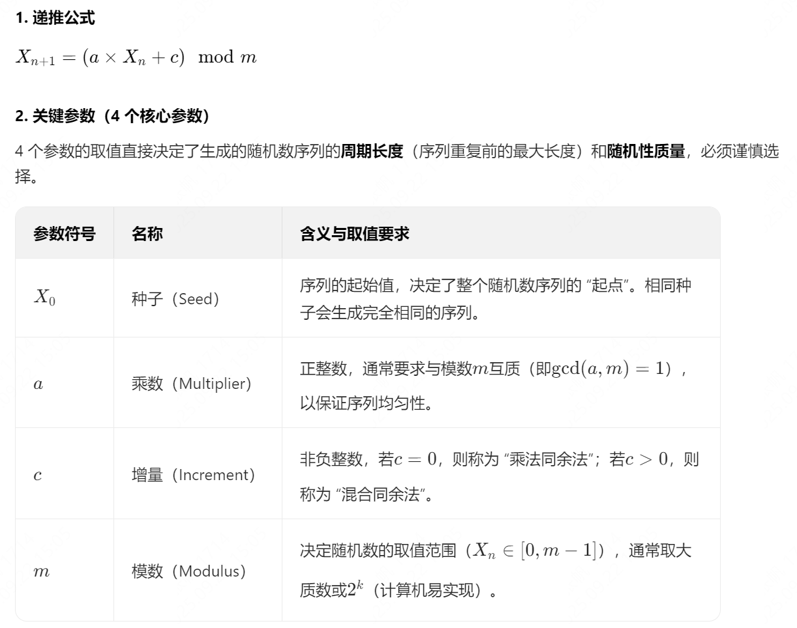

# 序号混淆

用于将序号混淆为另一个值, 不同的序号混淆结果必然不同.
提供了一个随机数生成器, 在规定范围内生成的随机数不会重复.

# 示例

## id生成. 1e18 次生成结果不会重复, 支持多节点分布式生成

通过数值自增, 生成一个有序序号. 调用函数 `Confuse` 将序号映射为一个新的值, 在`seed`不变的前提下, 不同的序号映射的结果必然不同. 返回值区间在 [0, 1e18), 包含 0 不包含 1e18

```go
const seed = 0xabcdef12 // seed 是一个随机数种子, 可以是任意值, 业务自行保管
sn := IncrBy() // IncrBy 是一个序号生成器, 用于数值自增. 可以考虑使用 redis 实现以支持分布式节点生成
id := lcgr.Confuse(sn, seed) // 使用 seed 混淆序号 
```

## 随机数生成, 生成 1e18 次结果不重复

在`seed`不变的前提下, 生成的随机数顺序是一样的. 返回值区间在 [0, 1e18), 包含 0 不包含 1e18

```go
const seed = 0xabcdef12 // seed 是一个随机数种子, 可以是任意值, 业务自行保管
r := lcgr.NewRandom(seed) // 创建一个随机数生成器
r.Next() // 生成随机数
```

# 核心原理

通过`线性同余法`实现, 并添加了一些数据转换的逻辑让随机值看起来更加分布均匀. `线性同余法（Linear Congruential Generator, LCG）`是一种伪随机数生成算法，由 Lehmer 于 1951 年提出，因其实现简单、计算高效的特点，被广泛应用于编程、模拟、统计等领域。其核心原理是通过**线性递推公式**和**同余运算**，生成一个具有周期特性的数值序列，该序列在周期内表现出类似随机的分布。



目前用的乘数(质数)为 `9999999967` , 经过实际验证, 在 9 位数之间可以映射为一个唯一值, 参考单测 `TestBasic`.

# 大数值映射原理


对于大数字 `1e18 - 1` 将数值拆为`高位数`和`低位数`. 如 `123456789987654321` 拆为了高位`H=123456789`和低位`L=987654321` 分别映射为一个新的值再组合.

这里为了让数值看起来更有随机性, 在高低位`HL`组合之前将其结果也进行高低位分隔并交换数据为`h2_h1`和`l2_l1`, 并交换顺序. 原理是在限制范围内不同的值内高低位交换必然得到不同的结果(不同值在经过相同的处理后结果必然不同). 这里高低位交换的时候其位数不同, 在经过多轮交换后, 会将顺序完全打乱. 而每一轮循环中, 我们对结果值还做了高低位交换, 5次循环后数据就完全打乱了.


